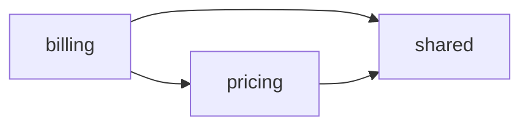

# Markdown Projection

IR (`aburi.ir.v1`) と Diff (`aburi.diff.v1`) から人間 + AI が読める Markdown を決定論的に派生する規約。

参照:
- [`ir-schema.md`](ir-schema.md) — projection 元のデータ構造
- [`diff-algorithm.md`](diff-algorithm.md) — diff Markdown の元データ
- [`extension-vocab.md`](extension-vocab.md) — vocab の表示単位

---

## 1. 目的

L3 IR は機械可読を最優先した JSON。
これを人間 + AI が「PR コメントで見る」「リポジトリ初見で読む」「単体シンボルを `aburi explain` で問い合わせる」3 つのユースケースに合わせて Markdown 化する。

projection は **決定論的** であり、同じ IR からは常に同じ Markdown が出る。

## 2. 出力ファイルレイアウト

```
out/
├─ workspace.md                       # L0 monorepo 全景
├─ components/
│  ├─ billing.md                      # L1 + L2 (billing component の全シンボル)
│  ├─ pricing.md                      # L1 + L2
│  └─ shared.md                       # L1 + L2
├─ diff.md                            # aburi diff の出力
└─ symbols/                           # aburi explain で個別生成 (オンデマンド)
   └─ ts-apps-billing-src-InvoiceService-ts-InvoiceService-createInvoice.md
```

- workspace.md: 常に 1 ファイル
- components/<id>.md: component ごと 1 ファイル (L1 + L2 を結合)
- diff.md: `aburi diff` 実行時のみ生成
- symbols/: `aburi explain` 実行時のみ生成

### 2.1 component ごとに L2 を結合する理由

シンボルごとに 1 ファイル化するとファイル数が肥大化 (数百 - 数千)、git diff が散逸する。
component 内で L1 (アーキテクチャ) と L2 (シンボル詳細) を結合し、1 component = 1 file とする。

巨大 component (>500 symbol) で読みづらくなる場合は将来 `components/<id>/symbols.md` への split を検討するが、v0.1 では結合を維持する。

## 3. 共通フォーマット規約

### 3.1 Markdown 方言

- CommonMark + GitHub-Flavored Markdown (tables / `<details>` / fenced code blocks)
- mermaid 図は ```` ```mermaid ```` フェンスを利用 (GitHub native レンダリング)
- HTML タグは `<details>` / `<summary>` / `<sub>` のみ使用 (CommonMark 互換性のため最小)

### 3.2 整列規約 (差分安定性のため固定)

| 対象 | 順序 |
|---|---|
| Component | `id` 昇順 |
| ファイル (component 内) | `path` 昇順 |
| Symbol (ファイル内) | `source.startLine` 昇順 (同一行は `id` 昇順) |
| Decorator (表示) | `line` 昇順 |
| Rule / Effect / Call | `line` 昇順 (= source order) |
| Dependency | `(from, to, via)` 辞書順 |
| Diff symbol entries (各セクション内) | `id` 昇順 |

整列規約は JSON 側と同じ (ir-schema §1)。projection で順序が変わると diff が無意味になる。

### 3.3 パス表示

- 常に POSIX (forward slash)
- workspace root 相対
- backtick で囲む: `` `apps/billing/src/InvoiceService.ts` ``

### 3.4 コード断片表示

| 長さ | 表示 |
|---|---|
| ≤ 80 char | インライン backtick: `` `customer.creditLimit < invoice.total` `` |
| > 80 char or 複数行 | フェンス code block (言語 hint なし) |
| 元の canonical 文字列が 120 char 超 | IR 段階で末尾 `...` 切詰済み (D4 §2.2) なのでそのまま使う |

### 3.5 Confidence バッジ

| 値 | 表示 |
|---|---|
| `high` | バッジなし (デフォルト) |
| `medium` | `⚠ medium` |
| `low` | `⚠ low` |

低 confidence のシンボル/効果はレビュアーに「機械の自信なし」を明示する。

### 3.6 dropped 表示

dropped シンボルは `<details>` 折りたたみで `## Dropped` セクションに表示:

```md
## Dropped

<details>
<summary>14 dropped symbols</summary>

- `ts:apps/billing/src/dto/create-invoice.dto.ts#CreateInvoiceDto` — pure DTO
- `ts:apps/billing/src/types.ts#Invoice` — interface (data model)

</details>
```

## 4. L0 — `workspace.md`

monorepo の全景。

### 4.1 構造

```md
# Workspace: <project name>

**Languages**: ts, py
**Managers**: pnpm (`apps/*`, `packages/*`), uv (`services/*`)
**Symbols**: 542 kept · 87 dropped (across 1234 files)
**Generated**: aburi 1.0.0 at 2026-06-21T15:30:00Z

## Components

| id | roots | languages | frameworks | symbols |
|---|---|---|---|---|
| billing | `apps/billing`, `packages/billing-domain` | ts | nestjs | 89 |
| pricing | `packages/pricing` | ts | — | 42 |
| shared  | `packages/shared`  | ts | — | 31 |

## Component dependencies



(mermaid を無効化した場合のフォールバック)

- billing → pricing (via import)
- billing → shared (via import)
- pricing → shared (via import)

## Effect surface (top 10 by count)

| effect | count | components |
|---|---|---|
| db.read | 41 | billing, pricing |
| db.write | 23 | billing |
| network.http | 8 | shared |
| event.publish | 5 | billing |
...
```

### 4.2 mermaid

mermaid graph が >100 ノードを超える場合は省略し、テキスト箇条書きのみ出す (見づらさ回避)。
config `output.mermaid: false` で無効化可能 (v0.2)。

### 4.3 generation metadata

`generatedAt` が IR に含まれる場合のみ表示。`--no-timestamp` 時は省略。

## 5. L1 + L2 — `components/<id>.md`

component の論理境界 + その component に属する全シンボル詳細。

### 5.1 構造

```md
# Component: billing

**Name**: Billing
**Roots**: `apps/billing`, `packages/billing-domain`
**Languages**: ts
**Frameworks**: nestjs
**Symbols**: 89 kept · 14 dropped

## Public API

- `apps/billing/src/routes/**`
- `ts:packages/billing-domain/src/index.ts#Invoice`

## Dependencies

- billing → pricing (via import)

## Symbols

(以下、§5.2 シンボル表示)

## Dropped

(§3.6)
```

### 5.2 Symbol 表示

ファイル別にグループ化、ファイル内は source.startLine 昇順:

```md
### `apps/billing/src/InvoiceService.ts`

#### `InvoiceService.createInvoice` *(method)*
**Boundary**: `@Post('/invoices')` `@UseGuards(AuthGuard)`
**Signature**: `(customerId: CustomerId, items: LineItem[]) → Promise<Invoice>` throws `CreditLimitExceeded` ⚡async
**Rules**:
- guard: `customer.creditLimit < invoice.total` (L58)
- throw: `new CreditLimitExceeded(customer.id, invoice.total)` (L60)
- return: `{ ...invoice, status: 'created' }` (L80)

**Effects**:
- db.write: `prisma.invoice.create` (L75)
- event.publish: `eventBus.emit` (L78) ⚠ medium

**Calls**:
- `pricing.calculateTotal` (L70)

<sub>api=`9ee77913af43` logic=`7ecf8c1cebe7` syntax=`a3f2e1d0c9b8`</sub>
```

### 5.3 セクション省略規約

シンボルのフィールドが空なら、対応セクションは出力しない:

- `decorators[]` 空 → **Boundary** / **Decorators** 行を省略
- `signature: null` → **Signature** 行を省略
- `rules[]` 空 → **Rules** セクション省略
- `effects[]` 空 → **Effects** セクション省略
- `calls[]` 空 → **Calls** セクション省略

すべて空のシンボル (class boundary なし、メソッドなし) は通常 dropped 扱いだが、boundary decorator だけ持つ module class などは Boundary 行のみ表示。

### 5.4 Decorator 表示

| 種別 | 表示行 |
|---|---|
| boundary=true のみ | `**Boundary**: \`@A\` \`@B\`` |
| boundary=false のみ | `**Decorators**: \`@A\` \`@B\`` |
| 混在 | 両方表示 |

### 5.5 Signature 表示

`(name: type, name: type) → output` 形式。複数 output は `|` 区切り。`throws: A, B` を追加。
`async` / `generator*` / `<T,U>` (型パラメータ) はバッジで併記。

例:
```
(id: string) → Promise<User | null> throws NotFoundError ⚡async
```

### 5.6 Rule 表示

| type | 表示 |
|---|---|
| guard | `- guard: \`<condition>\` (L<line>)` |
| throw | `- throw: \`<what>\` (L<line>)` |
| return | `- return: \`<expr>\` (L<line>)` |
| loop | `- loop (\`<loopKind>\`) (L<line>)` |
| try | `- try (L<line>)` |
| switch | `- switch: \`<condition>\` (L<line>)` |
| match | `- match: \`<condition>\` (L<line>)` |

### 5.7 Effect 表示

```
- <effect.id>: `<target>` (L<line>) [<plugin>]<confidence-badge>
```

例:
```
- db.write: `prisma.invoice.create` (L75) [effects-prisma]
- event.publish: `eventBus.emit` (L78) [effects-nest] ⚠ medium
```

`x-` プレフィックスの拡張効果も同じ表示形:
```
- x-stripe:charge: `stripe.charges.create` (L42) [effects-stripe]
```

### 5.8 Call 表示

```
- `<target>` (L<line>)
```

`resolved` が non-null なら省略可 (v0.2 で symbol id への内部リンク化を検討):
```
- `pricing.calculateTotal` (L70) → [`pricing.calculateTotal`](#pricing-calculatetotal)
```

### 5.9 Fingerprint 表示

`<sub>` で 3 軸を 1 行に:
```
<sub>api=`9ee77913af43` logic=`7ecf8c1cebe7` syntax=`a3f2e1d0c9b8`</sub>
```

fingerprint が全ゼロ (dropped) のシンボルは fingerprint 行を出さない。

## 6. Diff Markdown — `out/diff.md`

`aburi diff` の出力。PR コメント貼付を主用途とする。

### 6.1 全体構造

```md
# Aburi diff: <base.ref>..<head.ref>

**Summary**: +5 added · -3 removed · ~12 changed · 2 moved · 1 moved+changed

## ⚠ API 変更
## 🔧 Logic 変更
## ➕ Added
## ➖ Removed
## 🔀 Moved + Changed
## 🔀 Moved
## 🧱 Component changes
## 🔗 Dependency changes
## 💧 Dropped 変動
## 🎨 Syntax-only 変更
```

セクション順序は **重要度高 → 低** で固定。`<details>` で折りたたまれるのは下位 3 セクション (**Moved / Dropped / Syntax-only**)。Moved+Changed は意味変更が含まれるため折りたたまない。

### 6.2 各セクションの表示形

#### ⚠ API 変更

`status: "changed"` または `"moved+changed"` で `delta.apiChanged: true` のもの。

```md
### `InvoiceService.createInvoice` *(method)*
**File**: `apps/billing/src/InvoiceService.ts:42`

- signature.outputs: `Promise<Invoice>` → `Promise<InvoiceWithReceipt>`
- signature.throws added: `NotFoundError`
- decorator added: `@UseGuards(AuthGuard)`
- decorator removed: `@UseGuards(LegacyGuard)`
```

#### 🔧 Logic 変更

`delta.logicChanged: true` のもの。

```md
### `RolesGuard.canActivate` *(method)*
**File**: `apps/billing/src/guards/roles.guard.ts:9`

- effects added:
  - db.write: `prisma.audit.create` (L75)
- rules added:
  - guard: `!user.verified` (L42)
- rules removed:
  - guard: `roles.length === 0` (L40)
```

#### ➕ Added / ➖ Removed

シンボル全体表示 (§5.2 と同じ):

```md
### `InvoiceService.refundInvoice` *(method)*
**File**: `apps/billing/src/InvoiceService.ts:101`
**Boundary**: `@Post('/refund')`
**Effects**:
- db.write: `prisma.invoice.update` (L120)
**Rules**:
- guard: `!invoice.canRefund` (L110)
- throw: `new RefundNotAllowed()` (L111)
```

#### 🔀 Moved + Changed

```md
### `formatMoney` *(function)*
**Moved**: `apps/billing/src/util.ts` → `packages/billing-domain/src/util.ts` (`git-rename`)
**Logic 変更**:
- effects added:
  - state.mutate: `result.value += ...` (L12)
```

#### 🔀 Moved (折りたたみ)

```md
<details>
<summary>2 件 (意味変更なし)</summary>

- `formatMoney`: `apps/billing/src/util.ts` → `packages/billing-domain/src/util.ts` (`git-rename`)
- `parseAmount`: `apps/billing/src/util.ts` → `packages/billing-domain/src/util.ts` (`git-rename`)

</details>
```

#### 🧱 Component changes

```md
### Added

#### `payments`
**Roots**: `apps/payments`
**Languages**: ts
**Frameworks**: nestjs

### Changed

#### `billing`
- roots: `apps/billing` → `apps/billing, packages/billing-domain`
```

#### 🔗 Dependency changes

```md
### Added
- `billing` → `payments` (via `import`)

### Removed
- `billing` → `legacy-auth` (via `import`)
```

#### 💧 Dropped 変動 (折りたたみ)

```md
<details>
<summary>4 added / 1 removed</summary>

### Added
- `ts:apps/billing/src/dto/refund.dto.ts#RefundDto` — pure DTO

### Removed
- `ts:apps/billing/src/dto/legacy.dto.ts#LegacyDto` — pure DTO

</details>
```

#### 🎨 Syntax-only 変更 (折りたたみ)

`delta.syntaxChanged: true` かつ `apiChanged: false` かつ `logicChanged: false`:

```md
<details>
<summary>3 件 (実装リファクタのみ・意味変化なし)</summary>

- `InvoiceService.findAll` (`apps/billing/src/InvoiceService.ts:88`)
- ...

</details>
```

### 6.3 summary 1 行 (CLI stdout)

`aburi diff` 実行時に stdout へ 1 行サマリ:

```
+5 -3 ~12 ↔2 ⤴1   (added / removed / changed / moved / moved+changed)
```

詳細は `out/diff.md` を案内。

## 7. `aburi explain <id>` — 単体 Symbol

L2 を単独で表示。`out/symbols/<sanitized-id>.md` に書き出す or `stdout`。

```md
# `InvoiceService.createInvoice` *(method)*

**Component**: billing
**File**: `apps/billing/src/InvoiceService.ts:42-91`
**Visibility**: public
**Language**: ts

## Boundary
`@Post('/invoices')` `@UseGuards(AuthGuard)`

## Signature
```
(customerId: CustomerId, items: LineItem[]) → Promise<Invoice>
throws: CreditLimitExceeded
async
```

## Rules
- guard: `customer.creditLimit < invoice.total` (L58)
- throw: `new CreditLimitExceeded(customer.id, invoice.total)` (L60)
- return: `{ ...invoice, status: 'created' }` (L80)

## Effects
- db.write: `prisma.invoice.create` (L75) [effects-prisma]
- event.publish: `eventBus.emit` (L78) [effects-nest] ⚠ medium

## Calls
- `pricing.calculateTotal` (L70)

## Derived by
- `framework:nestjs:controller`
- `branch-condition`
- `throw-statement`
- `effects-plugin:prisma:write`

## Fingerprint
- api: `9ee77913af43`
- logic: `7ecf8c1cebe7`
- syntax: `a3f2e1d0c9b8`
```

`aburi explain` のデフォルト出力先は stdout、`--output <path>` でファイル書き出し。

dropped シンボルを explain した場合:

```md
# `CreateInvoiceDto` *(class)* — dropped

**Component**: billing
**File**: `apps/billing/src/dto/create-invoice.dto.ts:1-8`
**Drop reason**: pure DTO

(dropped シンボルは rules/effects/calls/fingerprint を持たないため詳細セクションなし)
```

## 8. Sanitization

`out/symbols/<id>.md` のファイル名は symbol id をサニタイズ:
- `:` → `-`
- `/` → `-`
- `#` → `-`
- `.` → `-`
- 連続 `-` を 1 個に圧縮

例: `ts:apps/billing/src/InvoiceService.ts#InvoiceService.createInvoice`
   → `ts-apps-billing-src-InvoiceService-ts-InvoiceService-createInvoice.md`

衝突 (異なる id が同じファイル名にサニタイズ) → サフィックスに id ハッシュ追加:
   → `...-createInvoice-<6hex>.md`

ハッシュアルゴリズムは fingerprint と同じ:
- `SHA-256(UTF-8(original Symbol.id))` の先頭 3 バイトを lowercase hex (= 6 文字) で suffix
- これにより同一 id は常に同一 suffix を持ち、ファイル生成が決定論的に

## 9. Mermaid 図 (オプション)

L0 workspace.md と将来の slice view (v0.2) で使用予定。

- `graph LR` (左→右) を Component 依存関係に使用
- ノード数 100 超で省略 (text 箇条書きにフォールバック)
- mermaid 描画失敗時にもテキスト版を併記 (GitHub の mermaid が落ちる稀ケースに備える)

mermaid 出力は `config.output.mermaid: false` で全 disable 可能 (v0.2)。

## 10. ローカライゼーション

Markdown は **英語ベースのセクション見出し + 日本語 OK の説明テキスト** とする。

理由:
- ユーザーは日本語話者 ([CLAUDE.md](../../../CLAUDE.md) Global Rules)
- レビュー対象 (PR) や AI consumer は両方
- セクション見出しを英語にすることで、PR コメントを国際チームでも使える

v0.1 では i18n 機構を持たず、固定文言。

## 11. 検証可能な性質

| ID | 入力 | 期待 |
|---|---|---|
| MP1 | 同 IR から 2 回 projection | 完全に同一の Markdown |
| MP2 | IR の整列を変えてから projection | 同一 Markdown (整列規約のため) |
| MP3 | `effects[]` 空のシンボル | Effects セクションが出力されない |
| MP4 | dropped シンボルが workspace に存在 | Dropped セクションが折りたたみ表示 |
| MP5 | confidence=medium の効果 | `⚠ medium` バッジが付く |
| MP6 | confidence=high の効果 | バッジなし |
| MP7 | mermaid ノード >100 | text 箇条書きにフォールバック |
| MP8 | `aburi explain <dropped-symbol>` | drop reason 表示、詳細セクションなし |
| MP9 | symbol id にスラッシュ/コロン | サニタイズ済みファイル名で書き出し |
| MP10 | diff で `delta.syntaxChanged` のみ true | Syntax-only セクション (折りたたみ) に分類 |
| MP11 | diff で moved+changed の symbol | Moved + Changed セクション (折りたたみなし) |
| MP12 | component 0 個 (空 IR) | workspace.md は出力されるが Components テーブルが空 |

## 12. 設計上の決定事項

### 12.1 L1 + L2 を 1 component file に結合

§2.1 参照。シンボル単位ファイル化はファイル数肥大のデメリットが大きい。

### 12.2 dropped を折りたたみで残す

drop の事実は透明性のために残すが、レビュアーの主視界からは外す。`<details>` 折りたたみが両立。

### 12.3 confidence=high はバッジなし

デフォルトに対する notice として medium/low のみバッジ。逆だとすべての高 confidence にバッジが付いて視覚的ノイズになる。

### 12.4 セクション順序を重要度順に固定

レビュアーが「先頭から読めばよい」状態を作る。API 変更が一番上、Syntax-only が折りたたみで一番下。

### 12.5 mermaid を文字列 fallback 併記

mermaid が GitHub でレンダリングに失敗するケース (大規模図 / 構文エラー) があるため、テキスト箇条書きも併記して情報を失わない。

### 12.6 セクション見出しを英語にする

国際チーム / OSS 利用を考慮。説明テキストは日本語で OK。

### 12.7 fingerprint を表示する理由

レビュー時には不要だが、debugging / 「なぜこれが diff に出たか」を説明するときに価値がある。`<sub>` で目立たない表示にとどめる。

### 12.8 emoji を使うか

セクション見出しの emoji (⚠ / 🔧 / ➕ 等) は視認性を上げる用途。CommonMark 互換、GitHub レンダリングで安定表示される範囲のみ使用。ユーザーの好みで disable する config (`output.emoji: false`) を v0.2 で検討。
