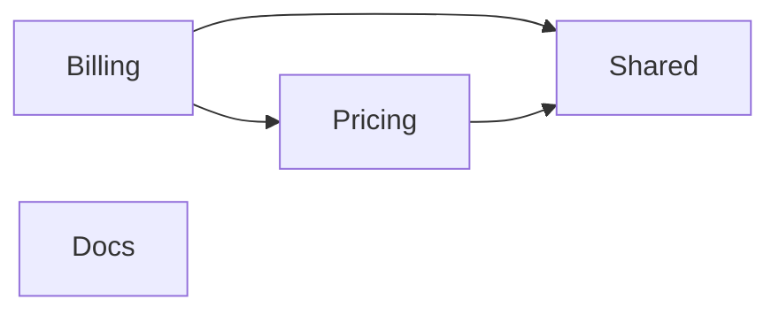

# Markdown Projection

The convention for deterministically deriving human- and AI-readable Markdown from the IR (`aburi.ir.v1`) and the Diff (`aburi.diff.v1`).

See:
- [`ir-schema.md`](./ir-schema.md) — the data structures the projection is derived from
- [`diff-algorithm.md`](./diff-algorithm.md) — the source data for the diff Markdown
- [`extension-vocab.md`](./extension-vocab.md) — display units for vocab

---

## 1. Purpose

The L3 IR is JSON that prioritizes machine readability above all.
It is rendered as Markdown to serve three human + AI use cases: "viewed in a PR comment", "read on first contact with a repository", and "querying a single symbol via `aburi explain`".

The projection is **deterministic**: the same IR always produces the same Markdown.

## 2. Output file layout

```
out/
├─ workspace.md                       # L0 monorepo overview
├─ components/
│  ├─ billing.md                      # L1 + L2 (all symbols of the billing component)
│  ├─ pricing.md                      # L1 + L2
│  └─ shared.md                       # L1 + L2
├─ diff.md                            # output of aburi diff
└─ symbols/                           # generated individually by aburi explain (on demand)
   └─ ts-apps-billing-src-InvoiceService-ts-InvoiceService-createInvoice.md
```

- workspace.md: always a single file
- `components/<id>.md`: one file per component (L1 + L2 combined)
- diff.md: generated only when `aburi diff` runs
- symbols/: generated only when `aburi explain` runs

### 2.1 Why L2 is combined per component

One file per symbol would explode the file count (hundreds to thousands) and scatter git diffs.
L1 (architecture) and L2 (symbol details) are combined within a component: 1 component = 1 file.

If a huge component (>500 symbols) becomes hard to read, a future split into `components/<id>/symbols.md` will be considered, but currently the combined form is kept.

## 3. Common format conventions

### 3.1 Markdown dialect

- CommonMark + GitHub-Flavored Markdown (tables / `<details>` / fenced code blocks)
- mermaid diagrams use ```` ```mermaid ```` fences (GitHub native rendering)
- HTML tags are limited to `<details>` / `<summary>` / `<sub>` (kept minimal for CommonMark compatibility)

### 3.2 Ordering conventions (fixed for diff stability)

| Target | Order |
|---|---|
| Component | ascending by `id` |
| Files (within a component) | ascending by `path` |
| Symbol (within a file) | ascending by `source.startLine` (ties broken by `id` ascending) |
| Decorator (display) | ascending by `line` |
| Rule / Effect / Call | ascending by `line` (= source order) |
| Dependency | lexicographic by `(from, to, via)` |
| Diff symbol entries (within each section) | ascending by `id` |

The ordering conventions match the JSON side (ir-schema §1). If the projection changed the order, diffs would become meaningless.

### 3.3 Path display

- Always POSIX (forward slashes)
- Relative to the workspace root
- Wrapped in backticks: `` `apps/billing/src/InvoiceService.ts` ``

### 3.4 Code fragment display

| Length | Display |
|---|---|
| ≤ 80 chars | inline backticks: `` `customer.creditLimit < invoice.total` `` |
| > 80 chars or multiline | fenced code block (no language hint) |
| Original canonical string exceeds 120 chars | already truncated with a trailing `...` at the IR stage ([`fingerprint.md`](./fingerprint.md) §2.2), so used as-is |

### 3.5 Confidence badges

| Value | Display |
|---|---|
| `high` | no badge (default) |
| `medium` | `⚠ medium` |
| `low` | `⚠ low` |

Low-confidence symbols/effects explicitly signal "the machine is not confident" to reviewers.

### 3.6 dropped display

Dropped symbols are shown in a `## Dropped` section inside a `<details>` fold:

```md
## Dropped

<details>
<summary>14 dropped symbols</summary>

- `ts:apps/billing/src/dto/create-invoice.dto.ts#CreateInvoiceDto` — pure DTO
- `ts:apps/billing/src/types.ts#Invoice` — interface (data model)

</details>
```

## 4. L0 — `workspace.md`

The monorepo overview.

### 4.1 Structure

````md
# Workspace: <project name>

**Languages**: ts, py
**Managers**: pnpm (`apps/*`, `packages/*`), uv (`services/*`)
**Symbols**: 542 kept · 87 dropped (across 1234 files)
**Generated**: aburi 1.0.0 at 2026-06-21T15:30:00Z

## Components

| id | roots | languages | frameworks | symbols |
|---|---|---|---|---|
| billing | `apps/billing`, `packages/billing-domain` | ts | nestjs | 89 |
| docs    | `docs`                                    | ts | —      | 4  |
| pricing | `packages/pricing` | ts | — | 42 |
| shared  | `packages/shared`  | ts | — | 31 |

## Component dependencies



Fallback list:

- billing → pricing (via `import`)
- billing → shared (via `import`)
- pricing → shared (via `import`)

## Files not analysed

3 of 1234 file(s) produced no Symbols.

- **over-size** (2):
  - `apps/web/public/bundle.js`
  - `packages/gen/schema.ts`
- **parse-failed** (1):
  - `apps/web/src/route.ts`

## Effect surface (top 10 by count)

| effect | count | components |
|---|---|---|
| db.read | 41 | billing, pricing |
| db.write | 23 | billing |
| network.http | 8 | shared |
| event.publish | 5 | billing |
...
````

**Files not analysed** is emitted only when `stats.skippedFiles` is non-empty (`ir-schema.md` §2), grouped by reason because the shape — one file, or all of them — is the thing to notice before the paths are. A document that predates the field omits the section rather than rendering it empty: "this run lost nothing" and "this writer could not say" are different answers, and the **Symbols** header line above distinguishes them by reporting `parsedFiles` beside `totalFiles` whenever the two differ.

### 4.2 mermaid

Every component declared in `ir.components` renders as a mermaid node — even
isolated ones with no incident dependencies — so the L0 view matches the
"full monorepo view" contract of [`overview.md`](./overview.md) §3.1
(`docs` above is such a node). Node declarations are ordered ascending by
`id`; edges are ordered lexicographically by `(from, to, via)`. Component
ids are ASCII kebab-case per [`ir-schema.md`](./ir-schema.md) §4, sanitized
to snake_case for mermaid (`billing-api` → `billing_api`) — the mapping is
injective because ComponentId cannot contain `_`. Labels use `Component.name`
with mermaid-hostile characters (`"`, `<`, `>`, `]`, newline) escaped so the
`id["label"]` syntax stays intact.

If the union of declared components and edge endpoints exceeds 100 nodes,
the mermaid block is replaced by an explicit `_Component graph omitted…_`
note so a missing diagram is not mistaken for a broken renderer, and only
the text bullet list of edges is emitted (avoids unreadability). Turning
mermaid output off entirely via config (e.g. `output.mermaid: false`) is
planned; the config-schema decision is pending.

### 4.3 generation metadata

Displayed only when `generatedAt` is present in the IR. Omitted under `--no-timestamp`.

## 5. L1 + L2 — `components/<id>.md`

The component's logical boundary + full details of every symbol belonging to that component.

### 5.1 Structure

```md
# Component: billing

**Name**: Billing
**Roots**: `apps/billing`, `packages/billing-domain`
**Languages**: ts
**Frameworks**: nestjs
**Symbols**: 89 kept · 14 dropped

## Public API

- `apps/billing/src/routes/**`
- `ts:packages/billing-domain/src/index.ts#Invoice`

## Dependencies

- billing → pricing (via import)

## Symbols

(symbol rendering per §5.2 follows)

## Dropped

(§3.6)
```

### 5.2 Symbol display

Grouped by file; within a file, ascending by source.startLine:

```md
### `apps/billing/src/InvoiceService.ts`

#### `InvoiceService.createInvoice` *(method)*
**Boundary**: `@Post('/invoices')` `@UseGuards(AuthGuard)`
**Signature**: `(customerId: CustomerId, items: LineItem[]) → Promise<Invoice>` throws `CreditLimitExceeded` ⚡async
**Rules**:
- guard: `customer.creditLimit < invoice.total` (L58)
- throw: `new CreditLimitExceeded(customer.id, invoice.total)` (L60)
- return: `{ ...invoice, status: 'created' }` (L80)

**Effects**:
- db.write: `prisma.invoice.create` (L75)
- event.publish: `eventBus.emit` (L78) ⚠ medium

**Calls**:
- `pricing.calculateTotal` (L70)

<sub>api=`9ee77913af43` logic=`7ecf8c1cebe7` syntax=`a3f2e1d0c9b8`</sub>
```

### 5.3 Section omission conventions

If a symbol's field is empty, the corresponding section is not emitted:

- `decorators[]` empty → omit the **Boundary** / **Decorators** line
- `signature: null` → omit the **Signature** line
- `rules[]` empty → omit the **Rules** section
- `effects[]` empty → omit the **Effects** section
- `calls[]` empty → omit the **Calls** section

A symbol with everything empty (class without boundary, no methods) is normally dropped, but a module class that carries only a boundary decorator, for example, shows the Boundary line only.

### 5.4 Decorator display

| Kind | Rendered line |
|---|---|
| boundary=true only | `**Boundary**: \`@A\` \`@B\`` |
| boundary=false only | `**Decorators**: \`@A\` \`@B\`` |
| mixed | render both |

### 5.5 Signature display

`(name: type, name: type) → output` form. Multiple outputs are separated by `|`. `throws: A, B` is appended.
`async` / `generator*` / `<T,U>` (type parameters) are shown alongside as badges.

Example:
```
(id: string) → Promise<User | null> throws NotFoundError ⚡async
```

### 5.6 Rule display

| type | Display |
|---|---|
| guard | ``- guard: `<condition>` (L<line>)`` |
| throw | ``- throw: `<what>` (L<line>)`` |
| return | ``- return: `<expr>` (L<line>)`` |
| loop | ``- loop (`<loopKind>`) (L<line>)`` |
| try | `- try (L<line>)` |
| switch | ``- switch: `<condition>` (L<line>)`` |
| match | ``- match: `<condition>` (L<line>)`` |

### 5.7 Effect display

```
- <effect.id>: `<target>` (L<line>) [<plugin>]<confidence-badge>
```

Examples:
```
- db.write: `prisma.invoice.create` (L75) [effects-prisma]
- event.publish: `eventBus.emit` (L78) [effects-nest] ⚠ medium
```

Extension effects with the `x-` prefix use the same form:
```
- x-stripe:charge: `stripe.charges.create` (L42) [effects-stripe]
```

### 5.8 Call display

```
- `<target>` (L<line>)
```

When `resolved` is non-null this may be elided (a future release will consider internal links to the symbol id — see the [roadmap](../roadmap.md)):
```
- `pricing.calculateTotal` (L70) → [`pricing.calculateTotal`](#pricing-calculatetotal)
```

### 5.9 Fingerprint display

The 3 axes on one line via `<sub>`:
```
<sub>api=`9ee77913af43` logic=`7ecf8c1cebe7` syntax=`a3f2e1d0c9b8`</sub>
```

Symbols whose fingerprint is all zeros (dropped) do not emit a fingerprint line.

## 6. Diff Markdown — `out/diff.md`

The output of `aburi diff`. Its primary use case is pasting into PR comments.

### 6.1 Overall structure

```md
# Aburi diff: <base.ref>..<head.ref>

**Summary**: +5 added · -3 removed · ~12 changed · 2 moved · 1 moved+changed · ?2 unknown

## ⚠ API changes
## 🔧 Logic changes
## ➕ Added
## ➖ Removed
## ❔ Unknown
## 🚫 Not compared
## 🔀 Moved + Changed
## 🔀 Moved
## 🧱 Component changes
## 🔗 Dependency changes
## 💧 Dropped changes
## 🎨 Syntax-only changes
```

The section order is fixed, **highest importance → lowest**. The bottom 3 sections (**Moved / Dropped / Syntax-only**) are folded in `<details>`. Moved+Changed is not folded because it contains semantic changes.

The `· ?N unknown` suffix on the Summary line appears only when `summary.unknown` is non-zero, so the line a reviewer skims on every PR does not carry a permanent `?0`. It qualifies the counts beside it: added and removed are both smaller than the truth by that much.

### 6.2 Display form of each section

#### ⚠ API changes

Entries with `status: "changed"` or `"moved+changed"` and `delta.apiChanged: true`.

```md
### `InvoiceService.createInvoice` *(method)*
**File**: `apps/billing/src/InvoiceService.ts:42`

- signature.outputs: `Promise<Invoice>` → `Promise<InvoiceWithReceipt>`
- signature.throws added: `NotFoundError`
- decorator added: `@UseGuards(AuthGuard)`
- decorator removed: `@UseGuards(LegacyGuard)`
```

#### 🔧 Logic changes

Entries with `delta.logicChanged: true`.

```md
### `RolesGuard.canActivate` *(method)*
**File**: `apps/billing/src/guards/roles.guard.ts:9`

- effects added:
  - db.write: `prisma.audit.create` (L75)
- rules added:
  - guard: `!user.verified` (L42)
- rules removed:
  - guard: `roles.length === 0` (L40)
```

#### ➕ Added / ➖ Removed

Full symbol rendering (same as §5.2):

```md
### `InvoiceService.refundInvoice` *(method)*
**File**: `apps/billing/src/InvoiceService.ts:101`
**Boundary**: `@Post('/refund')`
**Effects**:
- db.write: `prisma.invoice.update` (L120)
**Rules**:
- guard: `!invoice.canRefund` (L110)
- throw: `new RefundNotAllowed()` (L111)
```

#### ❔ Unknown

Entries with `status: "unknown"` — a Symbol one document has and the other never analysed the file for ([`diff-algorithm.md`](./diff-algorithm.md) §3.5.1). Rendered directly after Removed, because a reader who scrolled to Removed needs to see what is missing from it; rendered *apart* from it because the next action is different — an entry here is not a change to review but a gap to close.

```md
### `handleRequest` *(function)*
**File**: `apps/web/src/route.ts:12`
**Why**: the head scan skipped `apps/web/src/route.ts` (parse-failed), so this Symbol may still exist
```

`absentFrom: "base"` reads `may not be new` instead. The `reason` is quoted because it decides the next move: `parse-timeout` usually clears on a re-run, the rest clear only when the file is fixed.

#### 🚫 Not compared

`notCompared[]` — files **neither** revision analysed ([`diff-algorithm.md`](./diff-algorithm.md) §6.3), so nothing above says anything about them. Beside Unknown for the same reason Unknown sits beside Removed: a gap rather than a change. What separates the two is who can close it — an Unknown Symbol needs one revision re-scanned, while a file here was missed by both, and is usually a standing property of the workspace that every diff will keep missing until the cause is changed.

```md
- `vendor/bundle.js` — over-size on both
- `apps/web/src/route.ts` — parse-timeout at base, over-size at head
```

Both reasons, and only collapsed to one phrase when they agree. They can differ, and the pair is what says whether a re-run is enough.

The section is omitted when the array is empty, and equally when the key is absent — a diff written before the field existed cannot say what it missed, and rendering the section over an assumed empty list would report "nothing was missed" on every archived document.

#### 🔀 Moved + Changed

```md
### `formatMoney` *(function)*
**Moved**: `apps/billing/src/util.ts` → `packages/billing-domain/src/util.ts` (`git-rename`)
**Logic changes**:
- effects added:
  - state.mutate: `result.value += ...` (L12)
```

#### 🔀 Moved (folded)

```md
<details>
<summary>2 moved (no semantic change)</summary>

- `formatMoney`: `apps/billing/src/util.ts` → `packages/billing-domain/src/util.ts` (`git-rename`)
- `parseAmount`: `apps/billing/src/util.ts` → `packages/billing-domain/src/util.ts` (`git-rename`)

</details>
```

#### 🧱 Component changes

```md
### Added

#### `payments`
**Roots**: `apps/payments`
**Languages**: ts
**Frameworks**: nestjs

### Changed

#### `billing`
- roots: `apps/billing` → `apps/billing, packages/billing-domain`
```

#### 🔗 Dependency changes

```md
### Added
- `billing` → `payments` (via `import`)

### Removed
- `billing` → `legacy-auth` (via `import`)

### Unknown — the other revision never read one end
- `ts:src/route.ts#handleRequest` → `ts:src/log.ts#log` (via `call`) — the head scan skipped `src/route.ts` (parse-failed)
```

The Unknown group is not split by level the way the added and removed groups are. Only a Symbol endpoint has a file to lose ([`diff-algorithm.md`](./diff-algorithm.md) §6.2.1), so every entry in it is a symbol-level edge by construction. Each line names the file and the reason after the edge, because that is what decides the reviewer's next move — `parse-timeout` says re-run, `parse-failed` and `extraction-failed` say fix something.

#### 💧 Dropped changes (folded)

```md
<details>
<summary>4 added / 1 removed</summary>

### Added
- `ts:apps/billing/src/dto/refund.dto.ts#RefundDto` — pure DTO

### Removed
- `ts:apps/billing/src/dto/legacy.dto.ts#LegacyDto` — pure DTO

</details>
```

#### 🎨 Syntax-only changes (folded)

`delta.syntaxChanged: true` and `apiChanged: false` and `logicChanged: false`:

```md
<details>
<summary>3 symbols (implementation refactor only, no semantic change)</summary>

- `InvoiceService.findAll` (`apps/billing/src/InvoiceService.ts:88`)
- ...

</details>
```

### 6.3 One-line summary (CLI stdout)

When `aburi diff` runs, a one-line summary is printed to stdout:

```
+5 -3 ~12 ↔2 ⤴1   (added / removed / changed / moved / moved+changed)
```

It points to `out/diff.md` for the details.

## 7. `aburi explain <id>` — single Symbol

Renders L2 standalone. Written to `out/symbols/<sanitized-id>.md` or to `stdout`.

````md
# `InvoiceService.createInvoice` *(method)*

**Component**: billing
**File**: `apps/billing/src/InvoiceService.ts:42-91`
**Visibility**: public
**Language**: ts

## Boundary
`@Post('/invoices')` `@UseGuards(AuthGuard)`

## Signature
```
(customerId: CustomerId, items: LineItem[]) → Promise<Invoice>
throws: CreditLimitExceeded
async
```

## Rules
- guard: `customer.creditLimit < invoice.total` (L58)
- throw: `new CreditLimitExceeded(customer.id, invoice.total)` (L60)
- return: `{ ...invoice, status: 'created' }` (L80)

## Effects
- db.write: `prisma.invoice.create` (L75) [effects-prisma]
- event.publish: `eventBus.emit` (L78) [effects-nest] ⚠ medium

## Calls
- `pricing.calculateTotal` (L70)

## Derived by
- `framework:nestjs:controller`
- `branch-condition`
- `throw-statement`
- `effects-plugin:prisma:write`

## Fingerprint
- api: `9ee77913af43`
- logic: `7ecf8c1cebe7`
- syntax: `a3f2e1d0c9b8`
````

The default output of `aburi explain` is stdout; `--output <path>` writes to a file.

When a dropped symbol is explained:

```md
# `CreateInvoiceDto` *(class)* — dropped

**Component**: billing
**File**: `apps/billing/src/dto/create-invoice.dto.ts:1-8`
**Drop reason**: pure DTO

(dropped symbols carry no rules/effects/calls/fingerprint, so there are no detail sections)
```

## 8. Sanitization

File names under `out/symbols/<id>.md` sanitize the symbol id:
- `:` → `-`
- `/` → `-`
- `#` → `-`
- `.` → `-`
- consecutive `-` compressed to one

Example: `ts:apps/billing/src/InvoiceService.ts#InvoiceService.createInvoice`
   → `ts-apps-billing-src-InvoiceService-ts-InvoiceService-createInvoice.md`

Collision (different ids sanitize to the same file name) → an id hash is appended as a suffix:
   → `...-createInvoice-<6hex>.md`

The hash algorithm is the same as for fingerprints:
- the first 3 bytes of `SHA-256(UTF-8(original Symbol.id))` as lowercase hex (= 6 chars) form the suffix
- the same id therefore always gets the same suffix, keeping file generation deterministic

## 9. Mermaid diagrams (optional)

Emitted in the L0 `workspace.md` `## Component dependencies` section (see §4.2). Slice View has its own `## 🧵 Slice View` section within `out/diff.md`; see [`slice-view.md`](./slice-view.md) §12 for the rendering conventions.

- `graph LR` (left → right) is used for Component dependencies
- every component in `ir.components` renders as a node, including isolated ones with no incident edges
- omitted above 100 nodes measured against the union of declared components and edge endpoints (falls back to the text bullet list)
- a text bullet list accompanies the mermaid whenever there is at least one edge, so reviewers still see the dependency inventory even when GitHub's mermaid fails to render

Turning mermaid output off entirely via config (e.g. `output.mermaid: false`) is planned; the config-schema decision is pending.

## 10. Localization

All Markdown projection output is **English, with fixed wording**.

- There is currently no i18n mechanism; every heading, label, and message is a fixed English string.
- Section headings and labels are stable identifiers: CI pipelines and reviewers can rely on their exact text (e.g. matching `## Dropped` or the diff section titles).
- Fixed wording also keeps the projection deterministic and portable across environments and teams.

## 11. Verifiable properties

| ID | Input | Expected |
|---|---|---|
| MP1 | Projecting the same IR twice | Completely identical Markdown |
| MP2 | Reordering the IR, then projecting | Identical Markdown (due to the ordering conventions) |
| MP3 | Symbol with empty `effects[]` | No Effects section is emitted |
| MP4 | Dropped symbols present in the workspace | Dropped section shown folded |
| MP5 | Effect with confidence=medium | Gets the `⚠ medium` badge |
| MP6 | Effect with confidence=high | No badge |
| MP7 | mermaid nodes > 100 | Falls back to the text bullet list |
| MP8 | `aburi explain <dropped-symbol>` | Drop reason shown, no detail sections |
| MP9 | Symbol id containing slashes/colons | Written under a sanitized file name |
| MP10 | diff where only `delta.syntaxChanged` is true | Classified into the Syntax-only section (folded) |
| MP11 | diff containing a moved+changed symbol | Moved + Changed section (not folded) |
| MP12 | 0 components (empty IR) | workspace.md is emitted, but the Components table is empty |

## 12. Design decisions

### 12.1 L1 + L2 combined into one component file

See §2.1. Per-symbol files carry the major downside of file-count explosion.

### 12.2 Keeping dropped entries, folded

The fact of a drop is retained for transparency, but kept out of the reviewer's primary view. A `<details>` fold satisfies both.

### 12.3 No badge for confidence=high

Only medium/low get badges, as a notice relative to the default. The reverse would put a badge on every high-confidence entry, creating visual noise.

### 12.4 Section order fixed by importance

Creates a state where a reviewer can simply read from the top. API changes come first; Syntax-only sits folded at the bottom.

### 12.5 Text fallback accompanying mermaid

mermaid can fail to render on GitHub (large diagrams / syntax errors), so a text bullet list is emitted alongside and no information is lost.

### 12.6 English section headings

Accounts for international teams and OSS usage. All projection output is fixed-wording English (§10).

### 12.7 Why fingerprints are displayed

Unnecessary during review, but valuable for debugging and for explaining "why did this appear in the diff". The `<sub>` rendering keeps the display unobtrusive.

### 12.8 Whether to use emoji

Emoji in section headings (⚠ / 🔧 / ➕ etc.) serve visibility. Only emoji that are CommonMark-compatible and render stably on GitHub are used. A config to disable them by preference (`output.emoji: false`) will be considered for a future release (see the [roadmap](../roadmap.md)).
